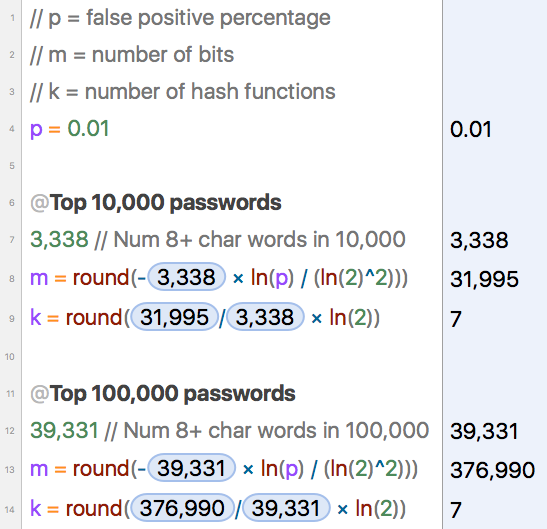

# Client side password field experiment
Using NIST, OWASP, NNGroup, bloomfilters to improve both security and user experience of password fields. Includes issues around accessibility of password requirement updates and 'show typing' implementations.

---
## Try It
You can try the full implementation at <https://mdfw.github.io/password-field-experiment/>

## Background
Late last week I read [Passwords Evolved: Authentication Guidance for the Modern Era](https://www.troyhunt.com/passwords-evolved-authentication-guidance-for-the-modern-era/) which led me to  [Microsoft Password Guidance](https://www.microsoft.com/en-us/research/wp-content/uploads/2016/06/Microsoft_Password_Guidance-1.pdf) and [NIST's current password guidelines](http://nvlpubs.nist.gov/nistpubs/SpecialPublications/NIST.SP.800-63b.pdf). Reading them reminded me of Nielsen Norman Group's post [Stop Password Masking](https://www.nngroup.com/articles/stop-password-masking/) and [OWASP's password recommendations](https://www.owasp.org/index.php/Authentication_Cheat_Sheet#Implement_Proper_Password_Strength_Controls).

You should read them. I can wait. It's a lot to digest.

I wondered how I might utilize all of these suggestions/requirements in a cohesive interface that would:

* be easy to understand
* create a resonably secure password
* follow best practices for accessiblity

One of the first things you'll note why reading the various papers above is that they don't always agree:

* Microsoft and NIST say not to worry about cap/lower/symbol requirements: "Eliminate character-composition requirements" but OWASP says unless you have a pass phrase (at least 20 characters) that you should have them.
* Microsoft says 8 char minimum (and longer not better?), OWASP says at least 10

For our needs, we're going to mix and match to get something that's reasonably standard (aka something people are used to) but also makes for a better password.

## Our requirements:

* A maximum of 256 characters - could be larger or smaller, but this seemed a reasonable max.
    * Note: probably only show the max limit if someone actually goes over it since it's likely an edge case.
* A minimum of 8 characters
* If password is 8-20 characters
    * At least 1 upper case character
    * At least 1 lower case character
    * At least 1 number
    * At least 1 special character
* Above 20 characters, lose the composition requirements. 
* The password fields should be actual password fields at load. 'show typing' will flip that to a regular text field if necessary.
* Should have 2 password fields to verify that the user correctly entered their password, *unless* a user chooses the 'show typing' option. Then we don't need to verify and can take the second one out.
* Cannot be a 'common password'
* Cannot have the company name in the password

## 'Common' passwords and Bloomfilters
### Background
How do you test against a common password? Let's also stipulate that you want to prevent a round trip to the server. You could send a list of common passwords to the client in clear text, but that just doesn't seem like a good idea, especially since many of the password lists I've seen contain...let's call them "non-worksafe words".

That's where bloom filters come in. Quoting from [Wikipedia](https://en.wikipedia.org/wiki/Bloom_filter):
> A Bloom filter is a space-efficient probabilistic data structure, conceived by Burton Howard Bloom in 1970, that is used to test whether an element is a member of a set. False positive matches are possible, but false negatives are not – in other words, a query returns either "possibly in set" or "definitely not in set".

If you don't fully understand it try this interactive demo: [https://www.jasondavies.com/bloomfilter/](https://www.jasondavies.com/bloomfilter/) which is based on his own bloom filter written in JS: [https://github.com/jasondavies/bloomfilter.js](https://github.com/jasondavies/bloomfilter.js).

### Build the filter
So, we can build a bloom filter with all of the common passwords, serialize and send it to the browser. You could have it lazy load, but for our example, we are not going to. 

We need a list of common passwords. Luckily, [Daniel Miessler](https://github.com/danielmiessler) put together a number of lists of passwords in his [SecLists Github repo](https://github.com/danielmiessler/SecLists/tree/master/Passwords). I pulled down the 100, 500, 1,000, 10,000 and 100,000 top password lists to run tests against. 

_Note: You can run your own tests with the included `createbloom.js` and `validatebloom.js` files. These aren't sophisticated scripts so read the source if you want to know how to use them. You'll need a Node.js environment._

First thing we want to do is remove all passwords that are less than 8 characters from our lists since we won't accept less than 8 [see [aside](#note1) below]. Here's a chart of those files with the number of items over 8 characters.

filename | >= 8 chars | < 8 chars
-------- | ----------- | -------------
top_100.txt | 20 | 81
500-worst-passwords.txt | 46 | 454
top_1000.txt | 205 | 796
top_10000.txt | 3,338 | 6,663
top_100000.txt | 39,331 | 60,670

We want our bloom filter to have enough to actually filter some words out without being huge. The 100, 500 and 1000 count password files don't seem to have enough 'meat' in them to be useful so let's look at the 10,000 and 100,000 item files.

The [Wikipedia](https://en.wikipedia.org/wiki/Bloom_filter) entry gives some math on how to determine the size of your filter, but I found this [Stack Overflow answer by Ian Boyd](https://stackoverflow.com/a/22467497/1134731) to be more clear. Using his math and the handy dandy [Soulver](www.soulver.com) we can determine bit space size and number of hashes needed:

Running both of these through the included `createbloom.js` file, we get the following serialized file sizes:

file | size of serialized bloom filter
---- | ----
top_10000 | `10,931 bytes (11 kb)`
top_100000 | `129,327 bytes (129 kb)`

11kb is still maybe a bit much to send, but it might be reasonable (depending on your definition of reasonable). In the end, it's probably cheaper to ship off to the server for checking, but we're already down this road so let's finish.

### Validating the bloom filter
To check for false positives [[1](#note2)], I grabbed a set of words that I used in [another project](https://watchwordapp.com) [[2](#note3)] .  It has ~7,700 common English words. Running it through `validatebloom.js`, we get:

file | false positives
---- | ----
top_10000 | 2
top_100000 | 0

Those are reasonable scores for our implementation. 

## General user flow

1. Two password fields (main password and confirm password) are initially displayed. 
2. A Show typing button/switch is available. 
    * When switched
        1. The 'confirm' password field fades out
        2. The 'main' password field switches to a text field *see implementation area below for interesting accessibility issues with this*.
3. Show the following checks greyed:
    * Minimum of 8 characters
    * At least 1 upper case character
    * At least 1 lower case character
    * At least 1 number
    * At least 1 special character
    * Not a common password
    * Not our company name
4. As user types:
    - If passwords are less than 8 characters, show Minimum in red, everything else grey with status
    - If passwords above 8 but less than 20, show 20 greyed and others actively as their status (pass or fail)
    - If over 20, show yes for 20, hide composition items - common password and company name fields stay active.
    - If over 256, show overage

## Implementation Notes

* One issue I ran into was making the password typing visibility accessible. I initially used a toggle password field code from here: <http://www.mburnette.com/blog/toggle-password-field-text-visibility> but realized that as it keeps the text field (the visible password) and the password field (the 'hidden' text) in sync, it causes the browser not to call out the typed text when it's visible because it's being kept in sync between the two areas. I had to rewrite by swapping out the hidden field and syncing the content at that point.
* I also realized after I finished that preventing a user from using their username/email as a password is likely a good idea. That is left as an exersize for you. Pull requests accepted.
* I initially set the password requirements list as an `aria-live` area hoping that changes would be announced but found the input from the fields to override the announcement. I opted instead to adding an `aria-label` attribute to the password fields. As the errors change, they are added to the label. For instance, "Main password. Errors: Need 8 characters."
* To improve legibility for the visible requirements area, I assigned specific text for waiting, passing and failing items. "Need at least 8 characters" when failing a test will switch to "Has 8 characters" when passing.

## On the server side and password storage
I was more interested in how to present our limits to the user, but do remember to re-check against the requirements when the password gets server side and then store them well. Also from [Troy Hunt's article](https://www.troyhunt.com/passwords-evolved-authentication-guidance-for-the-modern-era):
> ...check out [OWASP's Password Storage Cheat Sheet](https://www.owasp.org/index.php/Password_Storage_Cheat_Sheet) for guidance there. Also have a good read of [how Dropbox securely stores your passwords](https://blogs.dropbox.com/tech/2016/09/how-dropbox-securely-stores-your-passwords/) which is a very interesting piece combining both a modern-day approach to hashing and the use of encryption.

I used the dropbox method on a couple of projects and I think it's a nice mix of secure in place and usable. 

There's also some good coverage of 2FA and notifications on login failure and success to inform users of potential threats which I think is a good user experience solution.

Also: You could use bloom filters with the larger files on a server backend - bloom filters are supposed to be more efficient than an array lookup. I did not test that but might be a good followup.

## Notes
<a name="note1">**Aside:**</a> While this is presented nice and step by step, the actual process included significant trial and error, walk-aways, _WHAT?!_'s and a few _aha!_ moments. I mention this to allow anyone new to this that are feeling imposter syndrome to not worry, it wasn't this clean. It just makes for a cleaner narrative this way. Imagine a movie montage with "[Weird Science](https://youtu.be/Jm-upHSP9KU)" playing in the background.

<a name="note2">**1:**</a> One concern with the bloom filter we are using is a possibility of [too many false positives](https://github.com/jasondavies/bloomfilter.js/issues/15) because of the hashing function used. If you decide to use this, you might want to do deeper tests than I did here. In testing the implementation, I did see a number of false positives.

<a name="note3">**2:**</a> Note: The English word list used to test the filter is not included in the repo as its license is not compatible.

## License 
* This text is copyright 2017 by Mark Williams
* The included code and HTML is MIT licensed